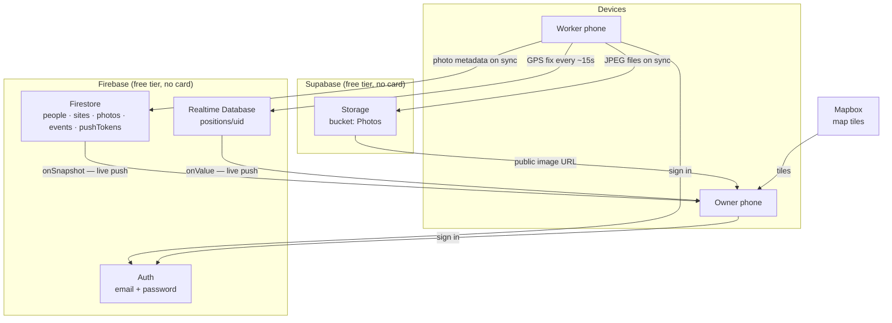
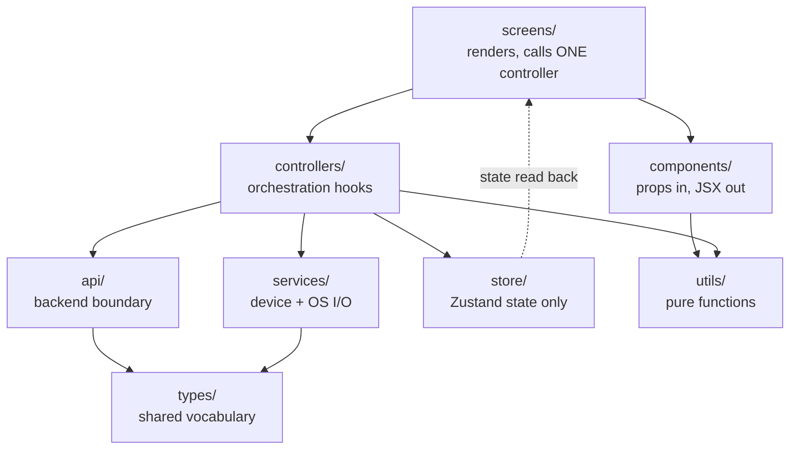
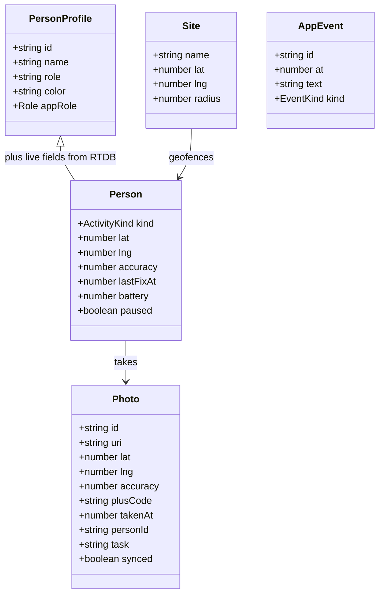
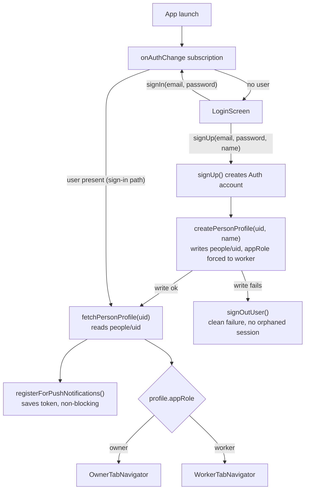
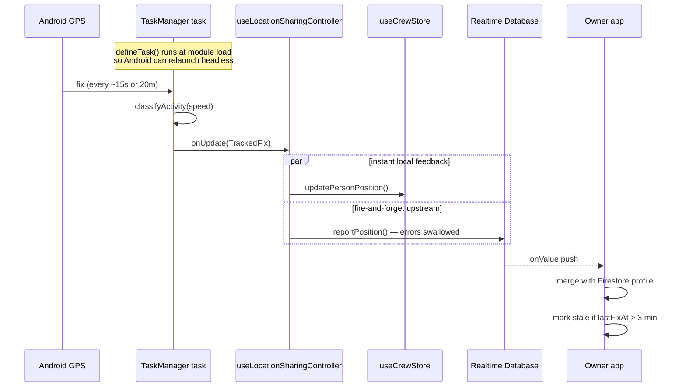
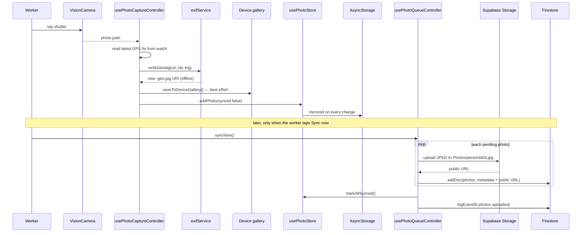
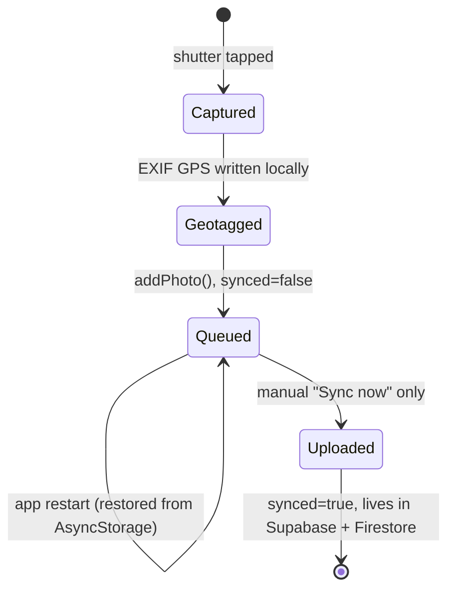
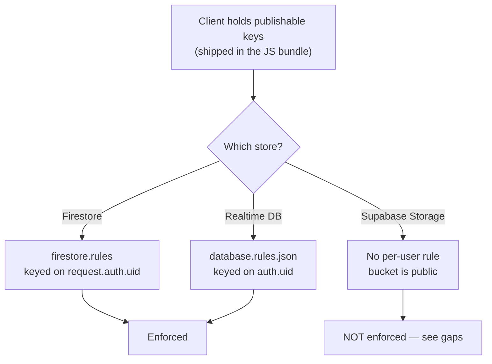

# Site Tracker — Project Overview

A complete walkthrough of what this app is, how it is built, how data moves
through it, and what is still unfinished.

For the *rules* about how to write code here, see [CLAUDE.md](CLAUDE.md).
For *setup steps*, see [README.md](README.md). This document explains the
**system** — read it first if you have never seen this codebase.

---

## 1. What the app does

Site Tracker is a two-sided mobile app for construction site crews.

**Workers** sign in on their phone, share their live location while on shift,
and take photos of site work that are stamped with exact GPS coordinates at
the moment of capture.

**Owners** sign in and see the whole crew live on a map, review the geotagged
photos that come in, adjust the site's geofence boundary, and watch an
activity feed.

| Role | Tabs | What they can do |
|---|---|---|
| **Worker** | Home, Camera, My Photos | Share/pause location, capture geotagged photos, sync the photo queue |
| **Owner** | Map, Crew, Photos, Sites | See live crew map, crew list, all photos, edit geofence radius, activity feed |

Which tab set you get is decided entirely by the `appRole` field on your
`people/{uid}` document in Firestore — not by anything you choose at login.

---

## 2. Tech stack

| Concern | Choice | Notes |
|---|---|---|
| Framework | Expo SDK 51 + React Native 0.74 | **Custom dev-client**, not Expo Go |
| Language | TypeScript (`strict: true`) | No `.js` allowed under `src/` |
| Navigation | React Navigation (bottom tabs) | Auth-gated root |
| State | Zustand | One store per domain, selector-based subscriptions |
| Maps | `@rnmapbox/maps` | Falls back to a static map if no token |
| Camera | `react-native-vision-camera` | Native module |
| Location | `expo-location` + `expo-task-manager` | Background foreground-service task |
| EXIF | `piexifjs` | GPS burned in locally, fully offline |
| Gallery | `expo-media-library` | Second copy of each capture into the device's own photos |
| Identity | Firebase Auth (email/password) | Owner accounts pre-seeded; workers can self-signup |
| Database | Firestore + Firebase Realtime Database | Split deliberately — see §4 |
| File storage | Supabase Storage | Not Firebase Storage — see §4 |
| Fonts | Plus Jakarta Sans | Loaded before first render |

> **Why a dev-client and not Expo Go:** Mapbox, Vision Camera and
> expo-notifications all ship native code that Expo Go cannot load. You must
> run `npx expo prebuild -p android` and build the app yourself.

---

## 3. System topology

Three external services, each doing exactly one job.



### Why three stores instead of one

This split is the single most important architectural decision in the
project, and it is driven by **billing models**, not by features.

| Store | Holds | Why this store |
|---|---|---|
| **Firestore** | Roster, sites, photo *metadata*, events, push tokens | Bills **per document read/write**. Fine for data that changes rarely. |
| **Realtime Database** | Live crew positions only | Bills **per byte transferred**. A GPS fix every 15s per worker would burn Firestore's daily read quota; a tiny `{lat,lng,accuracy}` blob is almost free on RTDB. |
| **Supabase Storage** | The actual `.jpg` files | Firebase Storage began requiring a Blaze billing account for *every* project in Feb 2026, even at zero usage. Supabase gives 1 GB with no card. |

The cost of this split: a `Person` shown on the map does not exist in any one
database. It is assembled client-side by merging a Firestore profile with an
RTDB position — see [`peopleApi.ts:29-42`](src/api/peopleApi.ts#L29-L42).

---

## 4. The layering rule

Every file has exactly one job. This is enforced by convention, and it is the
thing most likely to be violated by a careless change.



**The rules that matter:**

- A **screen** calls at most one controller hook and renders components. It
  never calls `fetch`, `AsyncStorage`, or `Location.*` directly.
- A **controller** is the only place allowed to combine a service call, an
  api call, and a store write. Named `use<Thing>Controller`.
- A **store** holds state and simple setters. No fetching, no side effects.
- A **service** talks to the device/OS (GPS, camera, disk, permissions) and
  holds no app state.
- An **api/** file talks to Firebase/Supabase and knows nothing about React.

### Current controllers

| Controller | Used by | Responsibility |
|---|---|---|
| `useAuthController` | RootNavigator, LoginScreen | Auth state → profile → role routing |
| `useCrewTrackingController` | Owner Map, Crew, Sites | Live crew + site, subscribed once per app run |
| `useLocationSharingController` | Worker Home | Permissions, start/stop tracking, report fixes |
| `usePhotoCaptureController` | Worker Camera | GPS watch, capture, EXIF, enqueue |
| `usePhotoQueueController` | Worker Queue, Owner Photos | Load queue, sync to backend |
| `useGeofenceController` | Owner Sites | Radius editing, who is inside |
| `useActivityFeedController` | Owner Activity | Live event feed |

---

## 5. Data model

All domain types live in [`src/types/domain.ts`](src/types/domain.ts) and are
imported everywhere else.



### Where each piece physically lives

| Type | Location | Path/collection |
|---|---|---|
| `PersonProfile` | Firestore | `people/{uid}` |
| `Person` live half | Realtime DB | `positions/{uid}` |
| `Site` | Firestore | `sites/default` (single-site for now) |
| `Photo` metadata | Firestore | `photos/{autoId}` |
| `Photo` file | Supabase | `Photos/{personId}/{photoId}.jpg` |
| `AppEvent` | Firestore | `events/{autoId}` |
| Push token | Firestore | `pushTokens/{uid}` |
| Unsynced photo queue | Device | AsyncStorage key `photoQueue` |

---

## 6. How each feature works

### 6.1 Authentication and role routing

Two ways into the app: sign in with a pre-seeded account, or sign up as a
new worker directly from LoginScreen. Owner accounts are still seed-script
only — self-signup can never produce anything but a worker.

**Seeded accounts** come from [`scripts/seedFirebase.js`](scripts/seedFirebase.js),
which uses the Firebase Admin SDK to create Auth users *and* their matching
`people/{uid}` profile documents in one pass, including the fixed-credential
admin owner login (`admin@admin.com`).

**Self-signup** is a toggle on LoginScreen ("Don't have an account? Create
one") — full name, email, password, confirm password. It's genuinely
verified end-to-end on a device: a real Firebase Auth account is created,
`people/{uid}` is written with `appRole: 'worker'`, and the app lands
straight in `WorkerTabNavigator`, no manual step in between.



**The security boundary is server-side, not client-side.** `firestore.rules`
only allows a `people/{uid}` *create* when `request.auth.uid == uid`,
`appRole == 'worker'`, and the payload has exactly the four allowed fields —
so a client cannot self-assign `appRole: 'owner'` no matter what it sends.
This was verified directly against the deployed project: a raw write with
`appRole: 'owner'` came back `403 PERMISSION_DENIED`; the same write with
`appRole: 'worker'` succeeded. Existing profiles are still immutable from
the client (`allow update, delete: if false`) — self-signup only ever
*creates* a document once, never edits one.

Four details worth knowing:

1. **`initializing` is `profile === undefined`**, distinct from
   `profile === null` (signed out). This three-state value is what stops the
   app flashing the login screen during startup — see
   [`useAuthController.ts`](src/controllers/useAuthController.ts).
2. **There is a dev bypass.** If `HAS_FIREBASE_CONFIG` is false, sign-in
   accepts *any* credentials and fabricates a local profile, so the UI is
   browsable with no backend. An email containing "worker" gets the worker
   role, anything else gets owner; the sign-up dev-bypass always fabricates
   a worker profile, matching the real flow. Both branches die the moment a
   real `projectId` is set.
3. **The auth-state race is handled explicitly.** Firebase's
   `onAuthStateChanged` listener fires the instant the Auth account exists —
   before `createPersonProfile` has written the doc it depends on. Without
   handling this, the shared listener would read a still-missing profile,
   get `null`, and bounce the brand-new user back to the login screen for a
   beat. `useAuthController` uses a single-shot ref to suppress exactly that
   one listener firing, then sets the profile itself once the write
   actually completes.
4. **A failed profile write signs the account back out.** If
   `createPersonProfile` throws after the Auth account was created (e.g. a
   rules mismatch), the account is not left in a broken signed-in-with-no-
   profile state — `signOutUser()` runs and the error surfaces normally, so
   the same email can be retried. What it can't do is delete the Auth
   account itself (the client SDK has no permission to delete arbitrary
   users); a profile-write failure leaves a real but inert Auth account
   behind, cleanable only via the Admin SDK or Firebase console.

### 6.2 Live location tracking

Two *separate* GPS subscriptions run, for different reasons.

| | Background tracking | Camera-screen watch |
|---|---|---|
| Accuracy | `Balanced` | `BestForNavigation` |
| Cadence | 15s or 20m moved | 500ms |
| Lifetime | Whole shift, survives app close | Only while Camera screen mounted |
| Purpose | Crew map | Precise photo geotag |



**Key points:**

- The task runs as an **Android foreground service** with a persistent
  notification, which is what lets it survive the app being backgrounded.
- `TaskManager.defineTask` is called at **module load**, not inside a
  component, because Android may relaunch the JS bundle headless.
- Writes are **fire-and-forget** — `.catch(() => {})`. A dropped fix is
  simply skipped; the next one is 15s away.
- **Staleness is computed on read, not written.** If `lastFixAt` is older
  than 3 minutes the person renders as `stale` regardless of their last
  reported activity, so a dead phone cannot look like it is still moving.
- Pause is a real backend write (`reportPauseState`) plus stopping the task,
  so the owner sees the pause immediately rather than waiting for a timeout.

### 6.3 Photo capture and sync

This is an **offline-first queue**. Capture never touches the network.



Photo lifecycle:



> **There is no automatic sync.** Nothing uploads on capture, on a timer, or
> on regaining connectivity. The only trigger is the worker tapping "Sync
> now" on the Queue screen. See §9.

**Each capture lands in two independent places.** The app's own queue
(`usePhotoStore` + AsyncStorage) is the source of truth for syncing; a copy
also goes into the device's gallery via
[`mediaLibraryService.ts`](src/services/mediaLibraryService.ts) so the baked
GPS is readable by Photos, a file manager, or a desktop over USB. The
gallery write is best-effort — a refused permission or a full disk skips it
without costing the worker the shot, and the two copies never interact
afterwards. `ACCESS_MEDIA_LOCATION` is declared because Android 10+
otherwise redacts GPS EXIF out of MediaStore reads, which would leave the
gallery copy looking location-less.

The EXIF write uses `arrayBuffer()` rather than `blob()` on upload, because
React Native's Blob polyfill silently truncates large images on Android —
see [`photosApi.ts:32-35`](src/api/photosApi.ts#L32-L35).

### 6.4 Geofence

The site is a single Firestore document (`sites/default`) with a centre and a
radius. The owner adjusts the radius with a slider; anyone inside is computed
client-side.

- Distance uses an **equirectangular approximation**, not haversine — far
  cheaper and accurate enough at site scale (tens to hundreds of metres).
  See [`geo.ts:21-25`](src/utils/geo.ts#L21-L25).
- Mapbox has no native geo-radius circle layer, so the fence is drawn by
  generating a 64-point GeoJSON polygon — [`geo.ts:46`](src/utils/geo.ts#L46).
- Below 80 m the UI warns that normal GPS drift will cause false
  arrive/leave readings (`driftSafeRadiusMeters`).

### 6.5 Activity feed

A live, append-only Firestore collection, capped at the 100 newest events and
pushed to owners via `onSnapshot`.

**Currently only two things ever write to it:** a worker pausing/resuming
sharing, and a photo batch being uploaded. See §9 — the arrivals and
departures the feed was designed for are never actually generated.

---

## 7. Security model



**Firestore** ([`firestore.rules`](firestore.rules)) — default-deny, then:

| Collection | Read | Write |
|---|---|---|
| `people/{uid}` | any signed-in user | create-once for **your own** doc, `appRole` pinned to `worker`, exact 4-field payload only; update/delete never from client |
| `sites/{id}` | any signed-in user | owner role only |
| `photos/{id}` | owner: all. worker: only their own | create only, and only with `personId == auth.uid` |
| `events/{id}` | any signed-in user | create only, never edit/delete |
| `pushTokens/{uid}` | owner role only | only your own document |

**Realtime Database** ([`database.rules.json`](database.rules.json)) — all
signed-in users may read every position; you may only write your own.

**Supabase Storage** — this is the weak point. Supabase's row-level security
keys off *Supabase's own* auth, and this app authenticates through Firebase.
The bucket is public, so:

- anyone with the publishable key can list and read **every** worker's photos
- anyone with that key can write into **any** `personId` folder
- the key ships inside the app bundle, so every worker has it

The `{personId}/` path prefix is organisational, **not** a security boundary.

---

## 8. Running the project

```bash
cp .env.example .env    # fill in Mapbox + Firebase + Supabase values
npm install
npx expo prebuild -p android
npm run android
```

Grant **"Allow all the time"** location plus camera on first launch, or the
worker flows silently do nothing.

```bash
npm run typecheck   # tsc --noEmit
npm run lint        # eslint
npm test            # jest
```

Backend setup (creating the Firebase project, deploying rules, seeding the
roster, creating the Supabase bucket) is covered step by step in
[README.md](README.md#backend-setup-firebase--supabase).

**Environment variables** — everything prefixed `EXPO_PUBLIC_` is inlined
into the JS bundle at build time and is therefore public by definition.
`MAPBOX_DOWNLOADS_TOKEN` is the exception: it is build-time only, used to
download the Mapbox SDK during prebuild, and never reaches the bundle.

---

## 9. What is still remaining

Ordered by how much it matters.

### 9.1 Correctness bugs — FIXED

All three are closed, each with a regression test.

| Issue | How it was closed |
|---|---|
| ~~Worker "My photos" shows everyone's photos~~ | `fetchPhotos(personId?)` now takes an optional scope ([`photosApi.ts`](src/api/photosApi.ts)); the controller passes the signed-in worker's id and `undefined` for an owner. Enforced server-side too — see §9.2. |
| ~~Sync failures are invisible~~ | `syncNow` wraps the upload in `try/catch`, exposes `syncing`/`syncError`, and the Queue screen renders a spinner plus a red error bar. The queue is untouched on failure, so retry is safe. |
| ~~Photo IDs are timestamp-only~~ | IDs now carry a random suffix. Covered by a test that freezes the clock and asserts two same-millisecond captures still differ. |

One further leak surfaced while fixing the first item and was closed too:
the photo store survived sign-out, so two workers sharing a handset would
inherit each other's list. The store now records **`loadedFor`** (whose
photos are held) and the controller reloads whenever that stops matching the
signed-in person; the on-disk queue is filtered by `personId` on load.

### 9.2 Security gaps

| Issue | Status |
|---|---|
| ~~Firestore photo metadata is crew-wide~~ | **Fixed.** `allow read: if isOwner() \|\| (signedIn() && resource.data.personId == request.auth.uid)`. Firestore evaluates this against the *query*, so a worker omitting the `personId` filter is rejected outright rather than silently filtered — the client cannot widen its own scope. Needs `firebase deploy --only firestore:rules,firestore:indexes`. |
| **Supabase bucket has no per-user isolation** | **Still open — needs a decision.** Every worker can still read and overwrite every other worker's *files*. Two options: (A) a Supabase Edge Function that verifies the caller's Firebase ID token before issuing an upload — free, more work; (B) move files back to Firebase Storage, whose rules can read `request.auth.uid` natively — simpler, but requires a Blaze billing account. |
| **Public bucket means public image URLs** | **Still open.** Anyone with a URL can fetch it, signed in or not. Private bucket + signed URLs, and it depends on the item above. |

> The Firestore fix hardens *metadata*. Until the Supabase question is
> decided, a worker who keeps a photo's public URL can still open it, and the
> bucket remains listable with the publishable key. Metadata isolation is
> real but partial.

### 9.3 Unfinished features

| Feature | State |
|---|---|
| **Geofence arrive/leave events** | **Never generated.** The Activity feed is documented as "arrivals, departures, low battery, uploads" ([`useActivityFeedController.ts:22`](src/controllers/useActivityFeedController.ts#L22)), but `logEvent` is only ever called for pause/resume and photo uploads. `useGeofenceController` computes who is inside for *display only* — there is no enter/exit transition detection. |
| **Push when the app is closed** | Tokens are registered and saved to `pushTokens/{uid}`, but nothing ever calls Expo's push API. Needs a server-side trigger (e.g. a Cloud Function on new `events` docs), which requires Firebase Blaze. |
| **Automatic photo sync** | Manual button only. No sync on capture, on timer, or on reconnect. |
| **Employee self-management** | **Partially closed.** Workers can now self-signup (§6.1) — no seed script needed to add one. Still missing: remove/deactivate a worker, change a role, or any owner-side roster management UI. Owner accounts are still seed-script-only, by design. |
| **Battery level** | `Person.battery` is never written from a real device API — it only ever holds its default. `expo-battery` would close this. |
| **Activity classification** | A raw speed threshold ([`locationService.ts:104`](src/services/locationService.ts#L104)). Android's ActivityRecognition API would be meaningfully better. |
| **Multi-site support** | Hardcoded to `sites/default` ([`siteApi.ts:8`](src/api/siteApi.ts#L8)). No site picker. |

### 9.4 Dead code and cleanup

| Item | Status |
|---|---|
| ~~`notifyLocally()`~~ | **Removed** from `pushService.ts`. |
| ~~`getCurrentFix()`~~ | **Removed** from `locationService.ts`. |
| `expo-sensors` | **Still present.** Unused, but it is a *native* module — removing it changes autolinking, and that can only be validated by a full Android build, which is currently blocked (§9.6). Deferred deliberately rather than changed blind. |
| `expo-background-fetch` | Same as above. |
| `src/constants/mockData.ts` | Still used as the no-Firebase fallback *and* as the seed script's source. Dual purpose is fine, but worth knowing it is not dead. |

### 9.5 Testing

Coverage is now **15 suites / 137 tests**, up from 2 suites / 17.

| Area | Suite | What it pins |
|---|---|---|
| Store | `usePhotoStore`, `stores` | id collisions, `loadedFor` handover, position updates, null-site guard, the three-state auth profile |
| API | `photosApi` | scoped vs unscoped queries; upload failure leaves **no orphan Firestore metadata** and stops the batch |
| API | `peopleApi` | staleness — a dead phone's last "vehicle" reading must not read as live; partial RTDB records; server-timestamp stamping; `createPersonProfile` always pins `appRole: worker` and never leaks a client-supplied `id` field |
| API | `eventsApi` | `at` normalisation across number / `Timestamp` / unresolved `serverTimestamp` (null) |
| API | `siteApi` | missing `sites/default` fails loudly rather than hanging every owner screen |
| Service | `locationService` | `classifyActivity` thresholds are exclusive; tracking is idempotent; the precise-fix watch does not leak when a screen unmounts before the subscription resolves |
| Service | `exifService` | N/S/E/W refs, DMS magnitude never signed, extension normalisation |
| Service | `photoQueueStorage` | corrupt JSON returns null instead of crashing on every launch; write failures never reject |
| Controller | `usePhotoQueueController` | role scoping, another person's leftovers dropped, sync failure surfaced and retryable |
| Controller | `useGeofenceController` | drift-risk boundary, local radius survives a failed backend write |
| Controller | `usePhotoCaptureController` | geotagged (not raw) file goes to the gallery; permission asked once per screen not once per shot; a refused/failed gallery save never costs the queued photo |
| Controller | `useAuthController` | the sign-up auth-state race (listener fires before the profile write completes) does not bounce the user to signed-out; a failed profile write signs the orphaned Auth account back out; the suppress flag is single-shot and doesn't eat a later unrelated sign-out |

Still uncovered: `useCrewTrackingController`, `useLocationSharingController`,
`useActivityFeedController`, `authService`/`pushService`/`permissionsService`,
and every screen and component. Screens would need render tests; the
remaining controllers are mockable the same way the covered ones are.

**Self-signup went further than unit tests** — it was verified live, on a
real device, against the deployed Firebase project: a real Auth account
created, sign-in with the typed password confirmed via direct API call, the
`people/{uid}` write confirmed to actually contain `appRole: worker`, and a
privilege-escalation attempt (`appRole: owner`) confirmed to be rejected
with `403 PERMISSION_DENIED` by the live security rule. See §6.1.

### 9.5.1 Latent display bugs found while writing these tests — FIXED

Both closed, each with regression tests in
[`formatters.test.ts`](src/utils/__tests__/formatters.test.ts).

- ~~`formatCoord` hardcoded the hemisphere~~ — it always appended `° N` and
  `° E`, so a southern/western coordinate like Sydney rendered as
  `-33.868800° N`. Now derives the letter from the sign and prints the
  magnitude: `33.868800° S`.
- ~~`timeAgo` could render a negative age~~ — `lastFixAt` is an RTDB
  *server* timestamp while `Date.now()` is the device clock, so a device
  running a few seconds behind the server could produce `-4s ago`. Now
  clamped at zero, reading as "just now".

### 9.6 Environment / operational

- ~~The Android emulator cannot start on this machine~~ — **resolved**, as of
  a later session (likely by a reboot; the earlier `WHPX: Failed to setup
  partition, hr=80070005` was a hypervisor conflict, not Memory Integrity —
  see the git history of this section if the exact cause matters later). The
  emulator now boots and has been used to verify both the photo-gallery
  save and the self-signup flow live against the real Firebase project.
- ~~Firebase rules and indexes must be deployed manually~~ — **deployed**,
  as of this session (`firebase deploy --only firestore:rules,firestore:indexes`).
  Both the photo-isolation fix and the self-signup rule are now live, not
  just present in the repo. Re-deploy any time `firestore.rules` or
  `firestore.indexes.json` changes — the repo state and the live project
  state are two different things, and only `firebase deploy` reconciles them.

---

## 10. File map

```
App.tsx                      Fonts, splash, ErrorBoundary, NavigationContainer
app.config.ts                Expo config, Android permissions, native plugins
firestore.rules              Firestore security rules (deploy manually)
database.rules.json          Realtime Database security rules
scripts/seedFirebase.js      Admin-SDK seeding — own package.json, never bundled

src/
  types/domain.ts            All shared models
  types/navigation.ts        Tab param lists
  types/*.d.ts               Ambient decls for untyped modules

  constants/theme.ts         Colors, spacing, radii, typography, gradients
  constants/config.ts        Tracking cadence, geofence bounds, env config
  constants/mockData.ts      Seed data (no-backend fallback + seed script)

  api/firebaseClient.ts      Single Firebase app + auth/firestore/rtdb handles
  api/supabaseClient.ts      Supabase client (Storage only, URL polyfill)
  api/peopleApi.ts           Roster + live positions, merged
  api/photosApi.ts           Photo fetch + Supabase upload + Firestore write
  api/siteApi.ts             Site doc read + geofence radius update
  api/eventsApi.ts           Activity feed subscribe + append

  services/locationService.ts     Background task, GPS watches, classification
  services/exifService.ts         Offline GPS-into-JPEG writer
  services/mediaLibraryService.ts Saves a capture into the device gallery
  services/authService.ts         Firebase Auth wrapper
  services/pushService.ts         expo-notifications registration
  services/permissionsService.ts  Location + gallery permission requests
  services/photoQueueStorage.ts   Typed AsyncStorage wrapper

  controllers/               Seven orchestration hooks (see §4)
  store/                     Five Zustand stores (auth, crew, site, photo, event)
  navigation/                RootNavigator + owner/worker tab navigators
  screens/owner/             Map, Crew, Photos, Sites, Activity
  screens/worker/            Home, Camera, Queue
  screens/common/            LoginScreen
  components/common|owner|worker/   Presentational pieces
  utils/formatters.ts        Display formatting
  utils/geo.ts               Distance, radius, plus codes, GeoJSON circle
```

---

## 11. Suggested order of work

Done: the original items 1, 2 and 5 (§9.1, §9.5), the emulator unblock, the
rules+indexes deploy, and self-signup with its security rule — all
verified live against the real Firebase project, not just in tests. What's
left, in order:

1. **Decide the Supabase isolation question** (§9.2) — option A (Edge
   Function, free, more work) or option B (Firebase Storage, simpler, needs
   Blaze). This is the only remaining genuinely architectural item, and it
   gates any deployment with more than one trusted crew.
2. **Generate geofence arrive/leave events** (§9.3) — the feed already exists
   and is subscribed to; only the transition detection is missing.
3. **Owner-side roster management** — self-signup covers *adding* a worker;
   there's still no in-app way to remove/deactivate one or change a role.
4. **Remove the two unused native deps** (§9.4) — trivial, and the emulator
   is unblocked now, so a full Android build can confirm autolinking still
   works before doing it.
5. **Clean up the one orphaned test roster entry** from this session's
   verification (a `people/{uid}` doc with no matching Auth account) —
   harmless, but only deletable via the Admin SDK or Firebase console, not
   the client.
